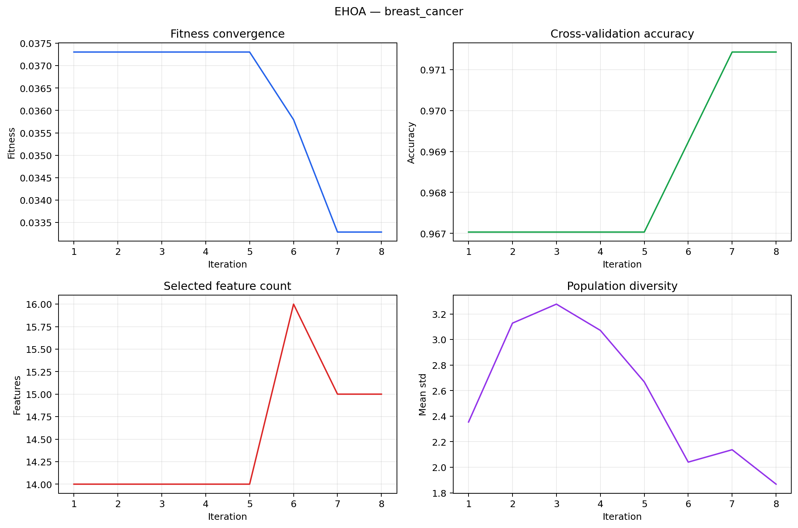

# EHOA Feature Selection — Reproducible Python Implementation

پیاده‌سازی آموزشی و قابل‌بازتولید مقاله‌ی زیر:

> Hegazy et al. (2026), *An enhanced Hiking optimization algorithm for accurate
> and interpretable feature selection in medical data classification*, Cluster
> Computing. DOI: https://doi.org/10.1007/s10586-026-05946-9

## مسیر سریع برای ارائه

- [گزارش کامل فارسی](docs/REPORT_FA.md)
- [پاورپوینت آماده ارائه](docs/EHOA_Presentation_FA.pptx)
- [سناریوی ارائه و پاسخ به سؤال‌های استاد](docs/PRESENTATION_FA.md)
- [جدول تطبیق معادلات مقاله با کد](docs/ARTICLE_TO_CODE.md)
- [گزارش خودکار آخرین اجرا](results/REPORT.md)

برای تست و اجرای کامل دموی ارائه با یک فرمان:

```powershell
.\run_demo.ps1
```

## چه چیزهایی پیاده‌سازی شده‌اند؟

- مقداردهی جمعیت با ۱۰ chaotic map و پیش‌فرض **Tent**؛
- sweep factor تطبیقی خطی، inertia weight و به‌روزرسانی PSO-like طبق Eq. 7 و 9؛
- تبدیل باینری S-shaped طبق Eq. 10 و 11؛
- fitness چندهدفه با `alpha=0.99` و 5-NN طبق Eq. 12؛
- 10-fold stratified CV در پروفایل مقاله؛
- preprocessing بدون data leakage: imputation، scaling و SMOTE فقط روی train هر fold؛
- ارزیابی held-out با KNN، Logistic Regression، SVM و Random Forest؛
- baseline روی همه‌ی ویژگی‌ها، چند seed مستقل و ذخیره‌ی زمان اجرا؛
- permutation importance واقعی و SHAP اختیاری؛
- خروجی CSV، JSON و نمودارهای قابل استفاده در گزارش.

## نتایج اجرای Quick

این اعداد فقط از مجموعه‌ی آزمون دست‌نخورده و با seed برابر ۴۲ محاسبه شده‌اند:

| Dataset | Selected features | Reduction | KNN accuracy | Balanced accuracy |
|---|---:|---:|---:|---:|
| Breast Cancer Wisconsin | 15 / 30 | 50.00% | 92.11% | 92.76% |
| Wine | 6 / 13 | 53.85% | 97.22% | 97.62% |



نتایج کامل همه‌ی classifierها در
[`results/<dataset>/classifier_metrics.csv`](results/breast_cancer/classifier_metrics.csv)
قرار دارند.

## نصب

```powershell
python -m venv .venv
.venv\Scripts\python -m pip install -r requirements.txt
```

برای SHAP:

```powershell
.venv\Scripts\python -m pip install -r requirements-explain.txt
```

## اجرا

اجرای سریع برای بررسی کد:

```powershell
.venv\Scripts\python main.py --profile quick --verbose
```

تنظیمات مقاله (۳۰ عامل، ۵۰ iteration، ۱۰ fold و ۲۰ اجرای مستقل) زمان‌بر است:

```powershell
.venv\Scripts\python main.py --profile paper --datasets breast_cancer --explain shap
```

دیتاست مصنوعی high-dimensional برای نمایش مسئله‌ی کلان‌داده/ابعاد بالا:

```powershell
.venv\Scripts\python main.py --profile quick --datasets high_dimensional
```

تمام پارامترها را می‌توان مستقل کنترل کرد:

```powershell
.venv\Scripts\python main.py --hikers 12 --iterations 20 --folds 5 --runs 3 --seed 42
```

## خروجی‌ها

در `results/<dataset>/` موارد زیر ساخته می‌شوند:

- `runs.csv`: نتیجه‌ی seedهای مستقل؛
- `classifier_metrics.csv`: مقایسه‌ی EHOA با تمام ویژگی‌ها؛
- `selected_features.csv`: نام و اندیس ویژگی‌های انتخاب‌شده؛
- `convergence.csv/png`: همگرایی fitness، accuracy، تعداد ویژگی و diversity؛
- `confusion_matrix_knn.png`: فقط روی test دست‌نخورده؛
- `feature_importance.csv/png`: توضیح‌پذیری واقعی، نه مقادیر تصادفی؛
- `classifier_comparison.png`: مقایسه‌ی EHOA و همه‌ی ویژگی‌ها روی hold-out؛
- `REPORT.md`: گزارش خودکار با تنظیمات و اعداد دقیق همان اجرا.

## نکته‌ی علمی مهم

این مخزن چارچوب صحیح آزمایش را فراهم می‌کند، اما ادعای بازتولید کامل نتایج مقاله
تنها پس از تهیه‌ی همان ۳۳ دیتاست، اجرای ۲۰ trial و مقایسه با GA/PSO/GWO/ALO/ACO/
SSA/HOA قابل طرح است. پروفایل `quick` فقط smoke test و دموی کلاسی است.

## تست

```powershell
.venv\Scripts\python -m pytest -q
```

## مجوز

کد تحت [MIT License](LICENSE) منتشر شده است. برای استفاده‌ی پژوهشی، مقاله‌ی اصلی
را با اطلاعات موجود در [`CITATION.cff`](CITATION.cff) استناد کنید.
