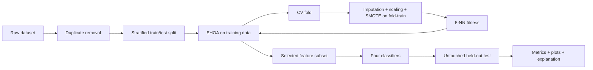

# گزارش پروژه: انتخاب ویژگی با الگوریتم EHOA

## مشخصات مقاله مرجع

**عنوان:** An enhanced Hiking optimization algorithm for accurate and interpretable feature selection in medical data classification  
**نویسندگان:** Hegazy و همکاران  
**نشریه:** Cluster Computing، سال ۲۰۲۶، جلد ۲۹، مقاله ۲۴۴  
**DOI:** [10.1007/s10586-026-05946-9](https://doi.org/10.1007/s10586-026-05946-9)

## چکیده

انتخاب ویژگی در داده‌های پزشکی یک مسئله‌ی بهینه‌سازی ترکیبیاتی است: باید هم‌زمان
خطای طبقه‌بندی و تعداد ویژگی‌ها کم شود. مقاله‌ی مرجع نسخه‌ی بهبودیافته‌ای از
Hiking Optimization Algorithm با نام EHOA معرفی می‌کند. سه تغییر اصلی آن عبارت‌اند
از مقداردهی اولیه با نگاشت‌های آشوبی، Sweep Factor تطبیقی و به‌روزرسانی سرعت
الهام‌گرفته از PSO. در این پروژه، نسخه‌ی باینری EHOA برای انتخاب ویژگی در پایتون
پیاده‌سازی شده و با یک پروتکل ارزیابی بدون نشت اطلاعات بررسی شده است. نتایج اجرای
سریع نشان داد که در Breast Cancer با انتخاب ۱۵ ویژگی از ۳۰ و در Wine با انتخاب
۶ ویژگی از ۱۳، دقت آزمون KNN به‌ترتیب ۹۲٫۱۱٪ و ۹۷٫۲۲٪ است.

## ۱. بیان مسئله

اگر مجموعه‌ی داده دارای \(d\) ویژگی باشد، فضای جست‌وجو شامل \(2^d\) زیرمجموعه است.
جست‌وجوی کامل برای داده‌های پُربعد عملی نیست؛ بنابراین از یک فراابتکاری wrapper
استفاده می‌شود. هر جواب یک بردار باینری است که مقدار ۱ به‌معنای انتخاب ویژگی و
مقدار ۰ به‌معنای حذف آن است. کیفیت هر جواب با عملکرد KNN و تعداد ویژگی‌های آن
سنجیده می‌شود.

ارتباط این موضوع با درس کلان‌داده فقط «حجم نمونه» نیست. چالش اصلی این مقاله
**بُعد بالا** و رشد نمایی فضای انتخاب ویژگی است. سناریوی `high_dimensional` پروژه
برای نمایش این وضعیت، ۵۰۰ ویژگی تولید می‌کند.

## ۲. الگوریتم پیشنهادی مقاله

### ۲.۱ مقداردهی آشوبی

به‌جای نمونه‌گیری تصادفی ساده، موقعیت عامل‌ها با دنباله‌ی آشوبی ساخته می‌شود:

$$
\beta_{i,j}=\phi_j^1+ch_j(\phi_j^2-\phi_j^1)
$$

ده نگاشت Singer، Sinusoidal، Gauss، Circle، Chebyshev، Iterative، Sine،
Piecewise، Logistic و Tent در پروژه موجودند. مطابق نتیجه‌ی مقاله، Tent مقدار
پیش‌فرض است.

### ۲.۲ Sweep Factor تطبیقی

برای حرکت تدریجی از اکتشاف به بهره‌برداری، ضریب حرکت به‌صورت خطی کاهش می‌یابد:

$$
SF(t)=SF_{max}-\frac{t}{T}(SF_{max}-SF_{min})
$$

در ابتدای جست‌وجو مقدار بزرگ‌تر، تنوع حرکت را افزایش می‌دهد و در انتها مقدار
کوچک‌تر باعث جست‌وجوی محلی دقیق‌تر می‌شود.

### ۲.۳ به‌روزرسانی سرعت

سرعت هر عامل از اینرسی، بهترین تجربه‌ی شخصی و بهترین جواب جمعیت ساخته می‌شود:

$$
V_{i,t}=\omega_tV_{i,t-1}+SF(t)\left[c_1r_1(p_{best,i}-\beta_{i,t})+
c_2r_2(\beta_{best,t}-\beta_{i,t})\right]
$$

در پیاده‌سازی، موقعیت پیوسته‌ی رهبر از ماسک باینری آن جدا نگهداری شده است؛ این
جداسازی برای سازگاری محاسبات سرعت ضروری است.

### ۲.۴ تبدیل باینری

احتمال انتخاب هر ویژگی با تابع S شکل محاسبه می‌شود:

$$
T_s(x)=\frac{1}{1+e^{-x}}
$$

سپس یک عدد تصادفی یکنواخت با این احتمال مقایسه و تصمیم صفر/یک تولید می‌شود.
موقعیت‌ها در بازه‌ی قابل تنظیم `[-6, 6]` قرار دارند تا sigmoid بتواند هم احتمال
نزدیک صفر و هم احتمال نزدیک یک بسازد.

### ۲.۵ تابع هدف

$$
Fitness=\alpha\times ErrRate+(1-\alpha)\times\frac{|S|}{|T|}
$$

در این رابطه \(|S|\) تعداد ویژگی‌های منتخب، \(|T|\) تعداد کل ویژگی‌ها و
\(\alpha=0.99\) است. بنابراین دقت طبقه‌بندی اولویت اصلی دارد، ولی جواب کوچک‌تر
در دقت‌های مشابه ترجیح داده می‌شود.

## ۳. معماری پیاده‌سازی

- `ehoa.py`: منطق جست‌وجو، تاریخچه‌ی همگرایی و مقایسه‌ی نگاشت‌ها؛
- `utils.py`: نگاشت‌ها، preprocessing بدون leakage، fitness و معیارها؛
- `main.py`: CLI، اجرای آزمایش، baselineها، نمودارها و گزارش خودکار؛
- `tests/`: آزمون‌های بازتولیدپذیری و سلامت پروتکل؛
- `results/`: artifactهای دقیق اجرای ثبت‌شده.

## ۴. جلوگیری از نشت اطلاعات

ترتیب صحیح عملیات مهم‌ترین تصمیم روش‌شناختی پروژه است:

1. نمونه‌های تکراری بدون مرتب‌کردن مجدد داده حذف می‌شوند؛
2. مجموعه‌ی آزمون پیش از انتخاب ویژگی جدا می‌شود؛
3. در هر fold، imputer و scaler فقط روی fold-train fit می‌شوند؛
4. SMOTE فقط روی fold-train اجرا می‌شود و validation هرگز oversample نمی‌شود؛
5. EHOA فقط دقت CV داده‌ی آموزش را می‌بیند؛
6. ارزیابی نهایی دقیقاً یک‌بار روی hold-out انجام می‌شود.

این طراحی مانع خوش‌بینی مصنوعی معیارها می‌شود.

## ۵. تنظیمات آزمایش

| پارامتر | Quick | Paper |
|---|---:|---:|
| تعداد عامل‌ها | ۸ | ۳۰ |
| iteration | ۸ | ۵۰ |
| fold | ۵ | ۱۰ |
| اجرای مستقل | ۱ | ۲۰ |
| نگاشت | Tent | Tent |
| K در KNN | ۵ | ۵ |
| α | ۰٫۹۹ | ۰٫۹۹ |

پروفایل Quick برای نمایش زنده و تست نرم‌افزار است. پروفایل Paper بودجه‌ی گزارش‌شده
در مقاله را اعمال می‌کند و زمان اجرای بیشتری دارد.

## ۶. نتایج

| دیتاست | کل ویژگی | منتخب | کاهش | CV Accuracy | Test Accuracy | Test BA |
|---|---:|---:|---:|---:|---:|---:|
| Breast Cancer | ۳۰ | ۱۵ | ۵۰٫۰۰٪ | ۹۷٫۱۴٪ | ۹۲٫۱۱٪ | ۹۲٫۷۶٪ |
| Wine | ۱۳ | ۶ | ۵۳٫۸۵٪ | ۹۷٫۸۶٪ | ۹۷٫۲۲٪ | ۹۷٫۶۲٪ |

در Wine، دقت KNN با همه‌ی ویژگی‌ها ۹۴٫۴۴٪ و پس از EHOA برابر ۹۷٫۲۲٪ است.
در Breast Cancer دقت KNN ثابت مانده، درحالی‌که تعداد ویژگی‌ها نصف شده است.
این نتیجه نشان می‌دهد subset منتخب می‌تواند اطلاعات پیش‌بینی را با پیچیدگی کمتر
حفظ کند. بااین‌حال، به‌علت اجرای تنها یک seed در Quick، این اعداد نباید به‌عنوان
اثبات آماری برتری الگوریتم تفسیر شوند.

## ۷. معیارهای ارزیابی

علاوه بر Accuracy، معیارهای Precision، Sensitivity، Specificity، F1، Balanced
Accuracy و MCC محاسبه شده‌اند. Balanced Accuracy برای داده‌ی نامتوازن مهم است،
زیرا میانگین recall کلاس‌ها را در نظر می‌گیرد و تحت سلطه‌ی کلاس اکثریت قرار نمی‌گیرد.

## ۸. توضیح‌پذیری

در اجرای پیش‌فرض از Permutation Importance روی داده‌ی آزمون استفاده می‌شود؛ یعنی
هر ویژگی جابه‌جا و افت Balanced Accuracy اندازه‌گیری می‌شود. برخلاف نسخه‌ی اولیه،
هیچ مقدار تصادفی با عنوان importance نمایش داده نمی‌شود. با نصب وابستگی اختیاری
SHAP می‌توان اجرای `--explain shap` را انتخاب کرد.

## ۹. اعتبارسنجی نرم‌افزار

شش تست خودکار موارد زیر را کنترل می‌کنند:

- خروجی محدود و متناهی همه‌ی نگاشت‌های آشوبی؛
- حفظ ترتیب ردیف‌ها هنگام حذف تکراری‌ها؛
- عدم اجرای SMOTE روی validation؛
- بازتولیدپذیری EHOA با seed ثابت؛
- سلامت ارزیابی hold-out با چهار classifier؛
- محاسبه‌ی صحیح Specificity در مسئله‌ی دودویی.

## ۱۰. محدودیت‌ها و کارهای آینده

- این مخزن هنوز نتایج کامل ۳۳ دیتاست مقاله را بازتولید نکرده است؛
- برای نتیجه‌گیری آماری باید ۲۰ اجرای مستقل و آزمون‌هایی مانند t-test/Holm اجرا شود؛
- مقایسه با GA، PSO، GWO، ALO، ACO، SSA و HOA اصلی می‌تواند اضافه شود؛
- دیتاست مصنوعی پُربعد جایگزین داده‌های واقعی gene-expression نیست؛
- اجرای SHAP نسبت به permutation importance هزینه‌ی محاسباتی بیشتری دارد.

## ۱۱. نتیجه‌گیری

این پروژه اجزای اصلی EHOA را به‌صورت بازتولیدپذیر پیاده‌سازی می‌کند و با جداسازی
صحیح train/test، preprocessing درون-fold و ارائه‌ی baseline، از خطاهای رایج
ارزیابی جلوگیری می‌کند. اجرای Quick نشان می‌دهد که می‌توان حدود نیمی از ویژگی‌های
دو دیتاست نمونه را حذف و عملکرد رقابتی را حفظ کرد. ادعای اصلی پروژه «پیاده‌سازی
صحیح و چارچوب آزمایش معتبر» است، نه ادعای بازتولید کامل همه‌ی نتایج مقاله.

