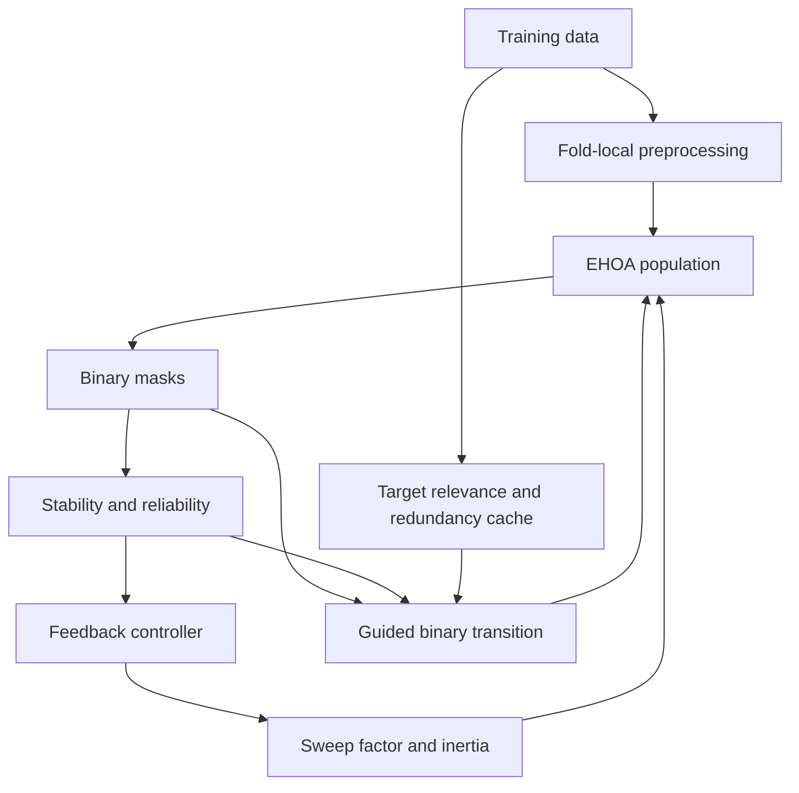

# DFA-EHOA methodology

## Formulation and notation

For (N) samples, (D) features, population (P), and (T) iterations, agent position (x_i\in\mathbb R^D) produces binary mask (z_i). The baseline minimizes classification error plus feature-ratio penalty. (q_j) is the smoothed selection frequency, (R_j=2q_j-1), (S_t) global Nogueira stability, (D_t) mean normalized pairwise Hamming distance, and (G_t\in[0,1]) the stagnation signal.

## Reliability and stability

Repeated class-stratified bootstrap samples are drawn exclusively from training data. Each resample builds a fixed-cardinality target-relevant solution using mutual-information ranking; these independent lightweight solutions estimate selection frequencies without recursively running DFA-EHOA. The cheaper population-mask proxy remains configurable but is not used by the principal protocol. Frequencies use exponential smoothing (q_j(t)=\rho q_j(t-1)+(1-\rho)\hat q_j(t)). Warm-up, clipping, smoothing, periodic/event-triggered updates, and a nonzero baseline transition probability reduce circular reinforcement. Jaccard and chance-corrected Nogueira stability are both reported.

## Regime-aware closed-loop controller

Let (U_t=1-S_t), (r_t=\min(1,D_t/0.5)), (L_t=1-r_t),
(G_t) be normalized stagnation and (\tau=t/T). The two corroborated drives are

\[E_t=L_t[0.5(1-\tau)+0.5G_t], \qquad C_t=U_t r_t\tau.\]

The signed adjustment is (A_t=\eta_EE_t-\eta_CC_t). Then
(SF_t=clip(SF_t^{base}(1+A_t),SF_{min},SF_{max})) and
(\omega_t=clip(\omega_t^{base}+0.25A_t,\omega_{min},\omega_{max})), followed
by controller smoothing. Thus, instability is not an exploration trigger on its
own: early collapse/stagnation drives exploration, while late uncertainty with
healthy diversity drives consolidation. This is the key correction over the
legacy additive-pressure prototype.

## Interaction-guided transition

Target mutual information supplies relevance. For candidate (j), cached absolute association to the current subset supplies redundancy (A_j(S)). The normalized score is (I_j(S)=MI(j;y)(1-A_j(S))-A_j(S)). Pearson association is deliberately **not** called interaction; it is only the inexpensive redundancy term. Top-k target-relevant neighborhoods bound memory and do not pre-filter the fitness search space.

Reliability evidence is entropy gated. With binary entropy (H_2),
(c_j=1-H_2(q_j)) is near zero for ambiguous (q_j\approx0.5) and approaches one
for consistent evidence. The transition is

\[p_{ij}(t)=\sigma(x_{ij}(t)+\lambda_s(t)c_j(t)R_j(t)+\lambda_i(t)I_j(S_i)).\]

Constant, linear and adaptive schedules are supported. Modes `baseline`, `stability`, `interaction`, and `dual` create the required 2x2 ablation.

## Algorithms (implementation-synchronised pseudocode)

1. **Baseline EHOA:** initialize chaotic positions; sample masks; evaluate inner CV; update personal/global best; linearly update SF/inertia; update velocity/position; repeat.
2. **Stability estimation:** collect current masks; optionally bootstrap masks; calculate/smooth frequencies; derive reliability; calculate Jaccard/Nogueira.
3. **Guided transition:** calculate scheduled weights; combine position, reliability and target-relevant redundancy score; sigmoid; Bernoulli sample; repair empty mask.
4. **Controller:** calculate exploration and consolidation drives from progress,
   uncertainty, diversity and stagnation; adjust and clip SF/inertia; smooth
   against the previous output.
5. **DFA-EHOA:** fit interaction model on training data; run baseline loop with Algorithms 2–4; record all controller telemetry.

## Complexity and ablation

Baseline wrapper cost is dominated by (O(TP\,CV\,C_{clf})). DFA adds pairwise population stability (O(TP^2D)) at configured update points and interaction preprocessing up to (O(NK^2+ND)) with top-k (K\le D); controller overhead is (O(T)). Runtime fields isolate interaction and stability computation. V0=baseline EHOA, V1=feedback/reliability, V2=interaction only, V3=dual. Equal iteration/population and evaluation-count-aware comparisons must both be reported.

